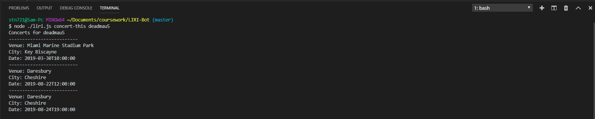
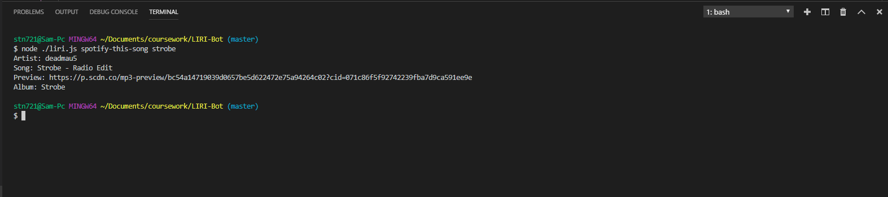
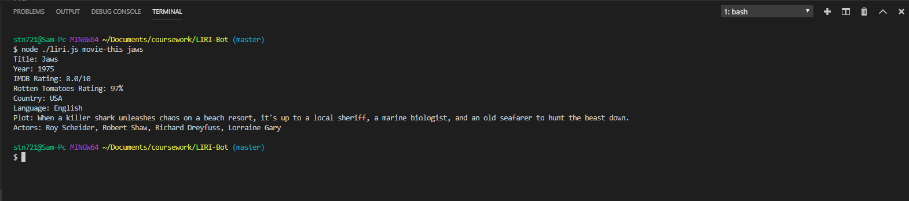
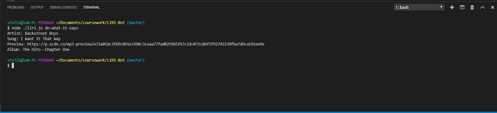

# LIRI-Bot

User searches an artist or band, and their upcoming concerts are displayed. The first argument must be "concert-this" and every argument after will be included in the search.

User searches a song and a description and preview are linked. The first argument must be "concert-this" and every argument after will be included in the search.

User searches a movie and various information is displayed. The first argument must be "concert-this" and every argument after will be included in the search.

The other functions can be accessed through a file. The argument to call this function is "do-what-it-says".

